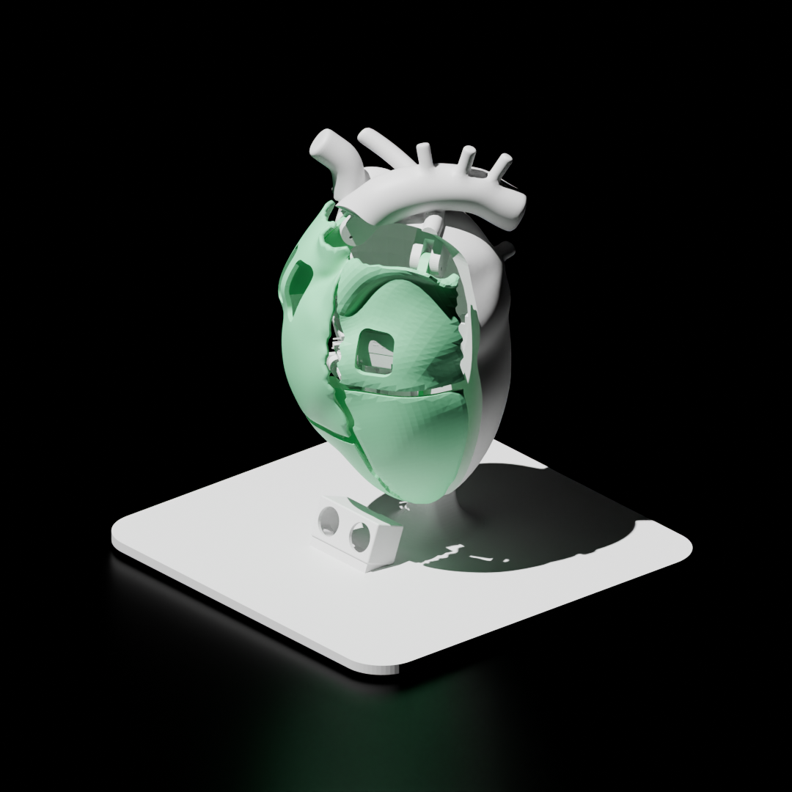

# Proof of Feeling

**Affective Core AC-7** — a speculative mechatronic artefact: an artificial
robotic heart that makes a humanoid AI's internal state visible through
pulse, motion, and light.

<p align="center">
  
  <br><sub>Render made in Blender.</sub>
</p>

See [`docs/design-reference.md`](docs/design-reference.md) for the full
project concept and design brief.

## Repository Layout

```
.
├── docs/               Project-wide documentation
│   ├── design-reference.md          Project context/story + physical prototype
│   └── pcb-design-reference.md      KiCad 10 PCB design reference
├── firmware/           ESP32-C6-Supermini embedded firmware
│   ├── src/             Servo sweep, LED chase, proximity speed, eye animation, BLE telemetry
│   └── include/          Pin assignments, tunables, BLE UUIDs
├── dashboard/          BLE debug dashboard — ASCII face/sonar/heartbeat, Web Bluetooth (Chrome/Edge only)
├── electronics/        KiCad PCB project (single-layer milled board)
└── mechanical/         3D models — printable STL/3MF tracked via Git LFS; source .blend files not included yet
```

## Hardware Summary

* ESP32-C6-Supermini
* 2x SG92R micro servos, 5V (continuous 0–180° sweep, mirrored) — chosen over MG995 for size
* HC-SR04 ultrasonic sensor (proximity → continuous speed control)
* 1x momentary button, wired but currently unused by firmware
* 8x auxiliary LEDs, top-to-bottom chase ("pulse point" glow array)
* I2C OLED (SSD1306-class), 4-pin header — always-on blinking eye
* BLE telemetry (built-in radio) — feeds the debug dashboard, see below
* Custom single-layer milled PCB (KiCad, `electronics/`)
* Powered via 5V DC barrel plug

## Tools

* 3D modelling — Blender
* PCB design — KiCad
* Firmware — written with the aid of Claude

<table>
  <tr>
    <td align="center"><br><sub>Populated board render</sub></td>
    <td align="center"><br><sub>B.Cu routing</sub></td>
    <td align="center"><br><sub>Desktop CNC isolation milling</sub></td>
  </tr>
</table>

## Build

<table>
  <tr>
    <td align="center"><br><sub>Assembly</sub></td>
    <td align="center"><br><sub>Finished artefact</sub></td>
  </tr>
</table>

## Getting Started

* Project context, story, and what a viewer experiences: [`docs/design-reference.md`](docs/design-reference.md)
* Firmware build/flash instructions: [`firmware/README.md`](firmware/README.md)
* PCB design reference: [`docs/pcb-design-reference.md`](docs/pcb-design-reference.md)
* KiCad project: [`electronics/EPD 3D G6.kicad_pro`](electronics/EPD%203D%20G6.kicad_pro)
* BLE debug dashboard: [`dashboard/index.html`](dashboard/index.html) — open directly in Chrome or Edge (desktop/Android; Web Bluetooth isn't supported in Firefox/Safari), click **Connect**, pick "AC-7"
